Path Tracer Episode IV: A New Material
======================

Sarah Forcier
58131867

Rough Mirror
------------
#### MIS, 900 Samples, 10 recursion
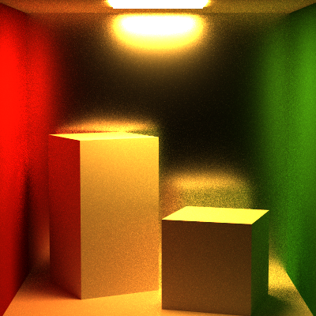
#### MIS, 900 Samples, 5 recursion
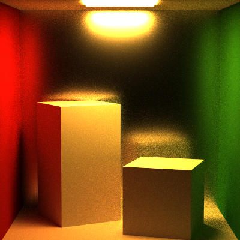
#### Naive, 900 Samples, 5 recursion

#### Direct, 900 Samples, 5 recursion
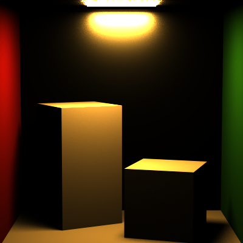
#### MIS, 100 Samples, 5 recursion
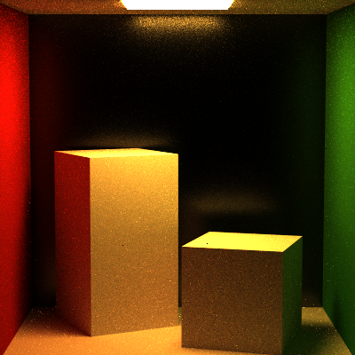
#### MIS Balance Heuristic, 100 Samples, 5 recursion

#### Naive, 100 Samples, 5 recursion

#### Direct, 100 Samples, 5 recursion
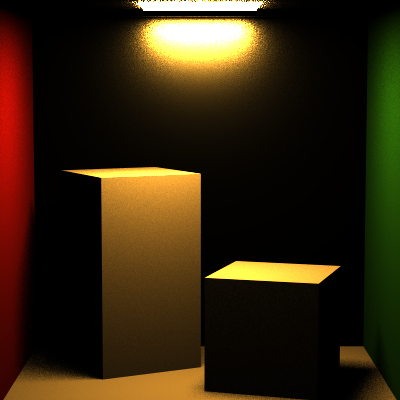

Veach
---------
#### MIS, 900 Samples, 5 recursion
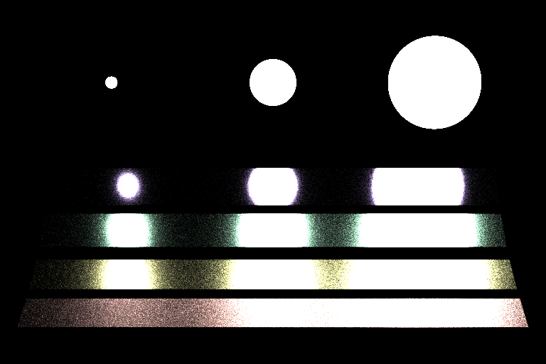
#### MIS, 100 Samples, 5 recursion
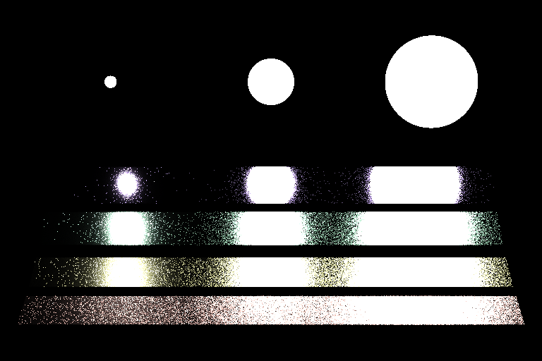
#### MIS Balance Heuristic, 100 Samples, 5 recursion

#### Naive, 900 Samples, 5 recursion

#### Direct, 900 Samples, 5 recursion
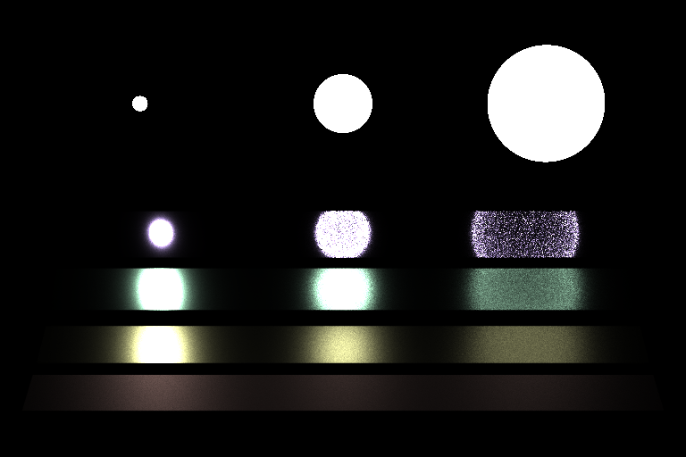

Plastic
--------------
#### MIS, 900 Samples, 5 recursion
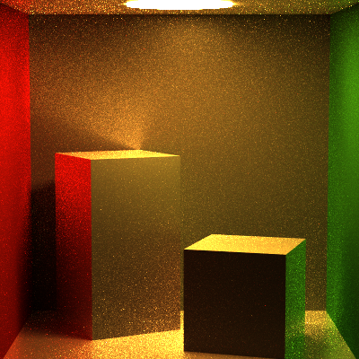
#### Naive, 900 Samples, 5 recursion

#### Direct, 900 Samples, 5 recursion
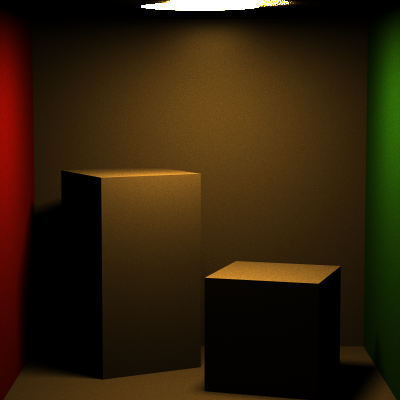

Gradient
--------------
#### MIS, 900 Samples, 5 recursion

#### Naive, 900 Samples, 5 recursion
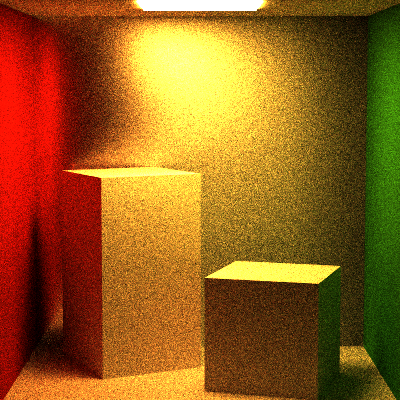
#### Direct, 900 Samples, 5 recursion
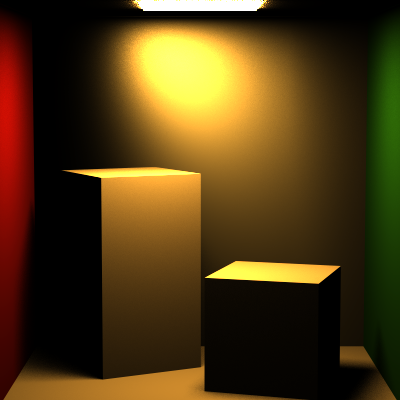

Map
--------------
#### MIS, 100 Samples, 5 recursion
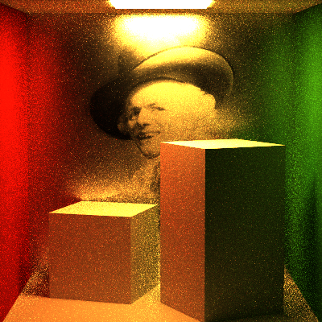
#### Naive, 100 Samples, 5 recursion
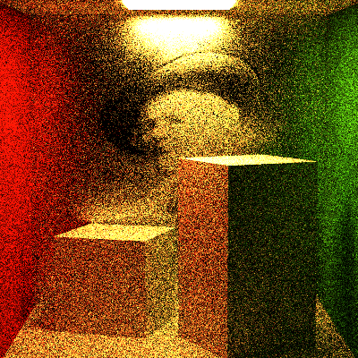
#### Direct, 100 Samples, 5 recursion
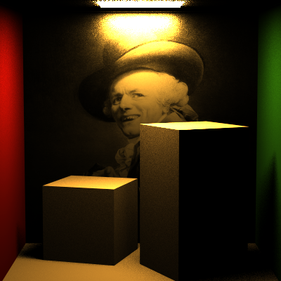

Extra credit 
-----------
#### Frosted Glass, 900 Samples, 5 recursion
Glass with microfacet reflection and transmission based on roughness value
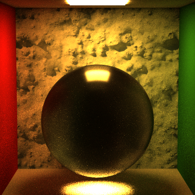

#### Beckmann
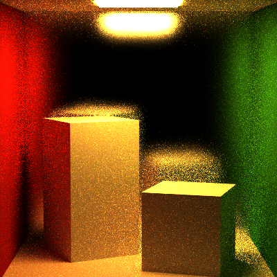