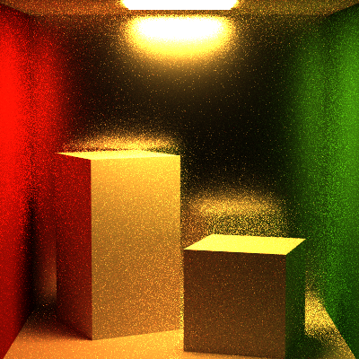
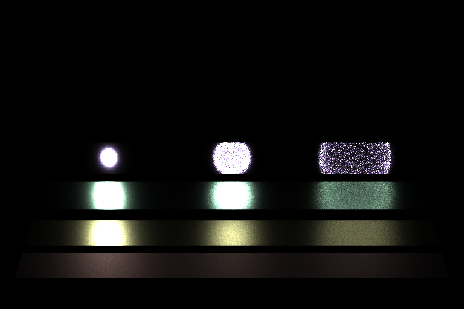
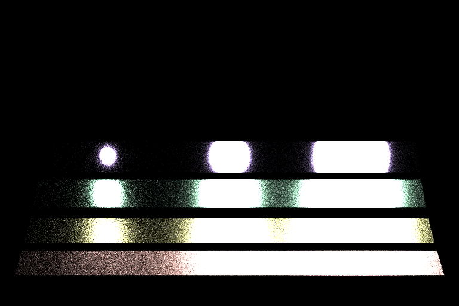

Path Tracer Episode IV: A New Material
======================

**University of Pennsylvania, CIS 561: Advanced Computer Graphics, Homework 6**

Overview
------------
You will once again implement two separate components for your path tracer: a
new `Integrator` class that combines the sampling techniques of your
`NaiveIntegrator` and `DirectLightingIntegrator` classes, and a set of `BxDF`
classes used to represent glossy surfaces using microfacet distribution models.
As in previous assignments, you may implement and test these features in any
order you see fit.

We have provided you with updated and new files for your existing path tracer
base code. Please copy your existing files into the assignment_package folder,
but __DO NOT__ replace any of the files we have provided with this assignment.
For some of your files, you may have to add function implementations to
various files to make your project compile again. However, just to re-iterate,
it is vital that you __DO NOT__ replace any of the files we have given you
for this assignment.

Useful Reading
---------
Once again, you will find the textbook will be very helpful when implementing
this homework assignment. We recommend referring to the following chapters:
* 8.4: Microfacet Models
* 9.2: Material Interface and Implementations
* 13.10: Importance Sampling

The Light Transport Equation
--------------
#### Lo(p, &#969;o) = Le(p, &#969;o) + &#8747;S f(p, &#969;o, &#969;i) Li(p, &#969;i) V(p', p) |dot(&#969;i, N)| _d_&#969;i

* __Lo__ is the light that exits point _p_ along ray &#969;o.
* __Le__ is the light inherently emitted by the surface at point _p_
along ray &#969;o.
* __&#8747;S__ is the integral over the sphere of ray
directions from which light can reach point _p_. &#969;o and
&#969;i are within this domain.
* __f__ is the Bidirectional Scattering Distribution Function of the material at
point _p_, which evaluates the proportion of energy received from
&#969;i at point _p_ that is reflected along &#969;o.
* __Li__ is the light energy that reaches point _p_ from the ray
&#969;i. This is the recursive term of the LTE.
* __V__ is a simple visibility test that determines if the surface point _p_' from
which &#969;i originates is visible to _p_. It returns 1 if there is
no obstruction, and 0 is there is something between _p_ and _p_'. This is really
only included in the LTE when one generates &#969;i by randomly
choosing a point of origin in the scene rather than generating a ray and finding
its intersection with the scene.
* The __absolute-value dot product__ term accounts for Lambert's Law of Cosines.

Updating this README (5 points)
-------------
Make sure that you fill out this `README.md` file with your name and PennKey,
along with your test renders. You should render each of the new scenes we have
provided you, once with each integrator type. At minimum we expect renders using
the default sample count and recursion depth, but you are encouraged to try
rendering scenes with more samples to get nicer looking results.

`DiffuseAreaLight::Pdf_Li` (5 points)
---------
Implement the `Pdf_Li` function declared in `diffusearealight.h` so that it
returns the PDF of the light's `Shape` given an `Intersection` from which the
light is being viewed and a viewing direction `wi`.

`FullLightingIntegrator` Class (40 points)
-----------
One of the main components of this homework assignment is to write an integrator
that incorporates multiple importance sampling to more effectively render all
light paths within a scene. In `FullLightingIntegrator::Li`, you will generate
both a direct lighting energy sample as in your `DirectLightingIntegrator` and a
`BSDF` energy sample as in your `NaiveIntegrator`. You will then weight each of
these energy samples according to the Power Heuristic and average them together
to produce an overall sample color. Note that, as in your `NaiveIntegrator`, you
will recursively call `Li` when you evaluate the LTE for your `BSDF` sample.

Balance Heuristic and Power Heuristic (10 points)
----------
At the bottom of `directlightingintegrator.cpp`, you will find definitions of
two functions: `BalanceHeuristic` and `PowerHeuristic`. Implement both of these
functions so they can be used in your implementation of
`FullLightingIntegrator::Li`. For your final renders, we ask that you provide
at least one example of a scene rendered with the balance heuristic and one
example of the same scene rendered with the power heuristic. For best render
results, we recommend you use the power heuristic for the rest of your images.

`MicrofacetBRDF` Class (25 points)
-------------
Implement the `f`, `Pdf`, and `Sample_f` functions of the `MicrofacetBRDF`
class so they follow the implementation of a Torrance-Sparrow microfacet BRDF.
The `MirrorMaterial` and `PlasticMaterial` classes make use of this BRDF
to create glossy surfaces. Note that this BRDF class makes use of a
`MicrofacetDistribution` pointer for some of the functions mentioned above.
We have provided you with the implementation of a Trowbridge-Reitz microfacet
distribution for use with your `MicrofacetBRDF` class functions; as noted in the
extra credit section, you may implement additional microfacet distributions if
you wish. Refer to `microfacet.h` for brief explanations of the functions of
this class.

Russian Roulette Ray Termination (15 points)
-------
In your `FullLightingIntegrator`, add a check to `Li` that terminates recursion
based on the Russian Roulette heuristic. This will necessitate adding one more
input to `Li`: a `Color3f` that tracks the compounded energy of the ray as it
travels along its path. If your integrator has performed at least three
recursions, then you should compare this compound energy to a uniform random
variable and terminate the path if the energy's highest component is less than
the random number. We recommend setting your recursion limit to a number much
higher than 5 to test your ray termination heuristic.

Example Renders
--------
Each of the images below was produced using multiple importance sampling and 100
samples per pixel, unless otherwise noted. Feel free to test your implementation
of the microfacet BRDF using the naive integrator and/or the direct lighting
integrator.

`PT_roughMirrorBoxUniform.json`

`PT_veachScene.json` (Since the lights are quite bright, a few of the
  BSDF-generated samples have generated "fireflies" and will require many more
  samples per pixel to correct)

`PT_veachScene.json` with 900 samples per pixel, direct lighting only and only
the rectangles rendered.

`PT_veachScene.json` with 900 samples per pixel, BSDF sampling only and only
the rectangles rendered.

Extra credit (30 points maximum)
-----------
In addition to the features listed below, you may choose to implement __any
feature you can think of__ as extra credit, provided you propose the idea to the
course staff through Piazza first.

__You must provide renders of your implemented features to receive credit for
them.__

#### `MicrofacetBTDF` Class (8 points)
Implement a BTDF that uses a microfacet distribution to generate its sample
rays. You will also have to add a new `Material` class or modify an existing
one, e.g. `TransmissiveMaterial`, to support this BxDF. You will also have to
add code to the `JSONLoader` class in order to load and render a scene that uses
this new material. Refer to how we implemented the updated `MirrorMaterial` for
ideas.

#### Additional `MicrofacetDistribution` Classes (5 points each)
Implement additional microfacet distribution classes for use in your
`MicrofacetBRDF` class, such as a Blinn distribution, a Phong distribution, or a
 Beckmann distribution.

#### Custom scene (5 points)
Now that you have implemented several different BSDFs and have written an
efficient global illumination integrator, you should try to create a customized
JSON scene of your own to render. We encourage everyone to be creative so you
all have unique material for your demo reels. Note that a custom scene that
includes one of the extra credit features listed above is a requirement of
those features implicitly; you must create an entirely novel scene (i.e. not
a variation on the Cornell box) to receive this extra credit.

Submitting your project
--------------
Along with your project code, make sure that you fill out this `README.md` file
with your name and PennKey, along with your test renders.

Rather than uploading a zip file to Canvas, you will simply submit a link to
the committed version of your code you wish us to grade. If you click on the
__Commits__ tab of your repository on Github, you will be brought to a list of
commits you've made. Simply click on the one you wish for us to grade, then copy
and paste the URL of the page into the Canvas submission form.
