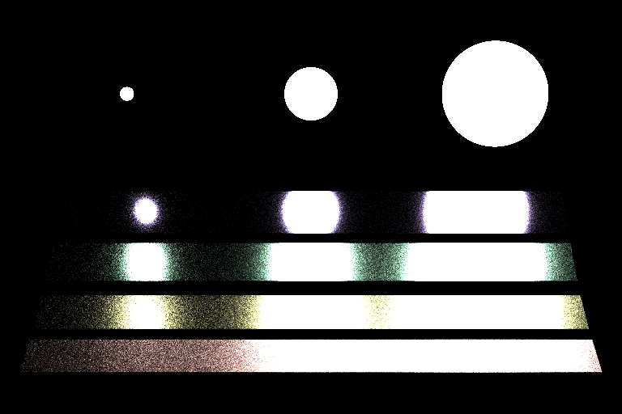
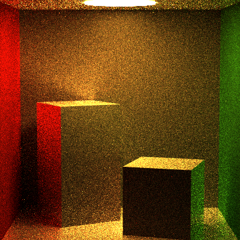

Path Tracer Episode IV: A New Material
======================

Sarah Forcier
58131867

Rough Mirror
------------
#### MIS, 900 Samples, 10 recursion

#### MIS, 900 Samples, 5 recursion

#### Direct, 900 Samples, 5 recursion

#### Naive, 900 Samples, 5 recursion

#### MIS, 100 Samples, 5 recursion

#### Direct, 100 Samples, 5 recursion

#### Naive, 100 Samples, 5 recursion

Veach
---------
#### MIS, 900 Samples, 5 recursion

#### Direct, 900 Samples, 5 recursion

#### Naive, 900 Samples, 5 recursion

Plastic
--------------
#### MIS, 900 Samples, 5 recursion

#### Direct, 900 Samples, 5 recursion

#### Naive, 900 Samples, 5 recursion

Gradient
--------------
#### MIS, 900 Samples, 5 recursion

#### Direct, 900 Samples, 5 recursion

#### Naive, 900 Samples, 5 recursion

Map
--------------
#### MIS, 100 Samples, 5 recursion

#### Direct, 100 Samples, 5 recursion

#### Naive, 100 Samples, 5 recursion

Extra credit 
-----------
#### Beckmann
